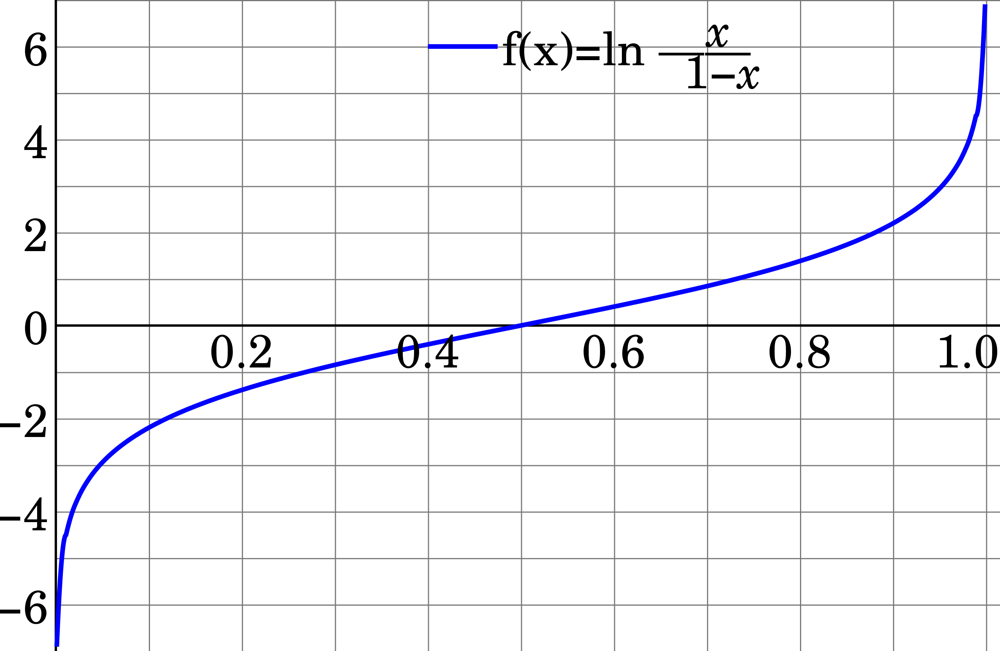

# Mathematics

## Logarithm

Is the inverse of exponentiation. If you think of exponentiation as a function `y = exp(x)`, the `x` is the base but we still need to specify `the power` / `the exponent` to which we raise the base, to get the value of `y`. E.g. if we choose the exponent = 4 and base = 2, then $y = \textrm{exp}_4(2) = 2 * 2 * 2 * 2 = 16$.

Similarly, logarithm needs a specified `base` to which the unknown `exponent` (in this case, the y) is to be raised to obtain the given x. Hence we have the base 10 logarithm $\textrm{log}_{10}$ and the natural logarithm $\textrm{ln}(x) = \textrm{log}_{e}(x)$, where `e` is the **Euler's number** which is a constant approximately equal to 2.718. 

For example, take $\textrm{log}_{10}(1000) = y$. In order to find `y`, we need to solve $10^y = 1000$, therefore $\textrm{log}_{10}(1000) = 3$. 

The important thing about logarithms is their graph shape, which is always `-inf` for `x = 0`, and then has a hyperbolic-esque curve where `log(x=1) = 0` and then begins to grow slower and slower. See this plot of a couple logarithms with different common bases:

Binary logarithm uses base = 2 and is common in computer science. Logarithms were invented by John Napier in 1614, to simplify calculations, specifically in navigation you can use logarithm tables to replace complex multiplications with additions. This is also why logarithms are popular in Machine Learning, where computation is a valuable resource and addition is cheaper than multiplication. This works because of the following rule:

**The logarithm of a product is the sum of the logarithms of the factors:** $\textrm{log}_{b}(p~q) = \textrm{log}_{b}(p) + \textrm{log}_{b}(q)$. 
There are some caveats - b, p and q all need to be positive and b cannot equal 1.

## Logit

The logit function, also known as **log-odds** function, take probability values ranging between 0 and 1 and turns them into real values between -inf and inf. It is the inverse of the sigmoid function. It's domain is thus <0, 1>. It can be used as the final layer of a neural network for e.g. classification tasks, where the previous layers output class probabilities between 0 and 1, and the logit function turns them into real numbers.

It takes the form $\textrm{logit}(p) = \textrm{ln}(\frac{p}{1-p}) = \textrm{ln}(p) - \textrm{ln}(1-p)$, due to the logarithm rule regarding logarithms of products being the sum of the logarithms of the factors of that multiplication. $p$ here stands for probability.

However, the term has a messy history within Deep Learning, where people refer to the **logits layer** as the one that feeds into a softmax activation, since the output of the softmax is interpreted as probabilities and the logit function is its inverse. Apparently some functions in e.g. tensorflow are named with the suffix like `tf.nn.softmax_crossentropy_with_logits` where it just means that input of this function is supposed to be output of the last neuron layer prior to the activation function. So it's messy.

Here's the graph:

Sources:
- [deepmind's definition](https://deepai.org/machine-learning-glossary-and-terms/logit)
- [stackoverflow on why it's confusing in DL](https://stackoverflow.com/questions/41455101/what-is-the-meaning-of-the-word-logits-in-tensorflow/52111173#52111173)

## Notation

Using KaTeX instead of LaTeX because that's what Notable supports. KaTeX is just a JS wrapper for LaTeX in markdown files and such.

- $\propto$
symbol for proportionality (it's not an alpha $\alpha$), alternatively ~ is used. It means that two values $x \propto y$ grow or decrease together by some ratio. For example the circumference of a circle is _directly_ proportional to its diameter, with constant proportionality $\pi$. There are also other reasons related to computers lacking inifnite floating point precision, the ability to prevent memory overflow reasons and that some ML concepts use logarithms by design to begin with, e.g. entropy and KL divergence.

- $\triangleq$
Is a symbol for _defined as_. Or more precisely _equal by definition_. As opposed to $\coloneqq$ which is the main symbol for definition.

- $\coloneqq$
symbol of _defined as_.

- $\sim$
the long tilde is used to mean _equivalence_. **But** it's also used in Bayesian Inference to mean sampling from, e.g. $\rho \sim \mathcal{N}(\mu, \sigma)$. Here rho is sampled from a Normal distribution, with given params (mean and stdev).

### Greek alphabet
- $\tau, \Tau$ - tau
- $\theta, \Theta$ - theta, often denotes learnable parameters
- $\mu, \Mu$ - pronounced _mju_, usually used to mean the mean (average)
- $\sigma, \Sigma$ - pronunciation _sigma_, lowercase is standard deviation, uppercase is sum.
- $\gamma, \Gamma$ - gamma
- $\lambda, \Lambda$ - lambda
