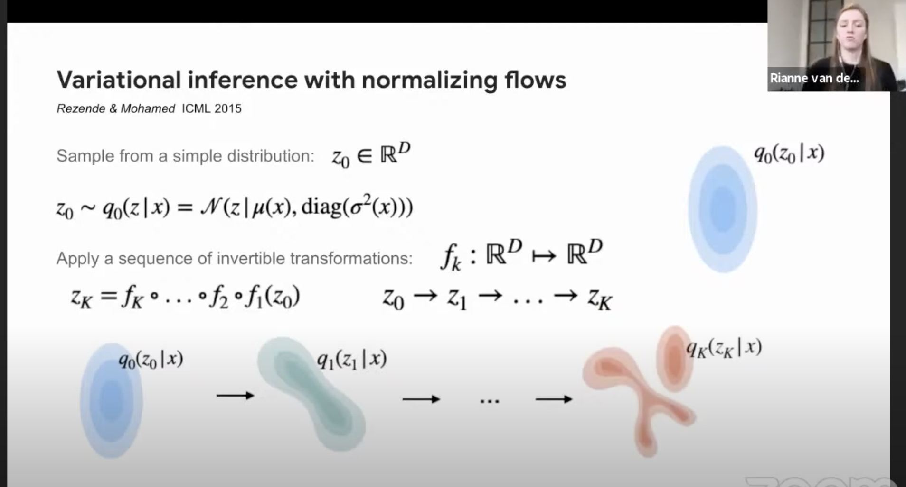

# Machine Learning

Definitions of concepts, practical tips, possibly notes on select papers. Goal is to solidify understanding by writing things down / explaining them to myself.


## Dirichlet Process

"_Distribution over distributions_"

In probability theory, a Dirichlet process is a probability distribution whose output is itself a set of probability distributions. It is used in **Bayesian Inference** (aka using Bayes Theorem to update the probability of a hypothesis as more evidence becomes available) to describe the prior knowledge about the distribution of random variables. In other words, to describe how likely it is that the random variables are distributed according to one or another probability distribution from some set of probability distributions.

For a real world example, imagine you have a bag with a 100 D20s from the same dice maker. You randomly draw a dice and roll it. All the random variables (dice rolls) from this bag should follow the uniform probability mass function. But if we also have a second bag of a 50 D20s from a dice maker that is not reliable, this second PMF would not be uniform. The randomness of these 2 PMFs can be modelled with the Dirichlet distribution. So there's one probability over which kind of dice you get (e.g. 100/150 or 50/150) and another about what you'll roll (either uniform on the fair die or sth weird on the bad ones).

Another example would come from modelling the distribution of words in text documents. Imagine you have a dictionary of k words. Each document can be represented as a PMF of length k, produced by normalizing the seen frequency of its words. A group of documents become a collections of PMFs, and we can fit a Dirichlet distribution ot capture the variability of these PMFs.

The Chinese Restaurant Process is a metaphor used to exemplify a Dirichlet Process. It also shows a "rich-get-richer" pattern, where whether a person sits at the currently occupied tables is dependent on how many people are already sitting there (positively). There's an analogous "stick-break" process, where we break a stick into smaller and smaller pieces.

The Dirichlet distribution is the extension of the Beta distribution (which outputs continuous values in range 0-1 and is parameterized by only two parameters $\alpha$ aand $\beta$).

Btw, it's named after Dirichlet (a German mathematician) but was invented by Thomas Ferguson in 1973.

Sources:
- [friendlier presentation on DP](https://youtu.be/I7bgrZjoRhM?t=688)
- [video on nonparametric clustering using DP](https://youtu.be/UTW530-QVxo?t=119)
- [long lecture specfically on DP](https://www.youtube.com/watch?v=bNbdsq8xlds&ab_channel=10-708PGM)

## Neural Structured Learning
Is a learning paradigm that came from Google's Tensorflow team around 2020, it leverages additional knowledge about some of the examples in the training set, such as their neighboring examples in some knowledge graph, and uses that knowledge to regularize during e.g. a classification of that sample, making models more robust.

For example imagine you're trying to classify an image of a dog. You might also have some data about other pictures of similar dogs, such that the current example picture is connected to its neighbors in a graph. The model is then fed the pictures of the neighbors along with the example, and then its loss is increased if the learned representation of the example and the neighbors is different.

Sources:
- [Google tensorflow NSL intro vid](https://www.youtube.com/watch?v=N_IS3x5wFNI)

## Latent Variables

The things that are not directly observed, which we are trying to infer from observed data. Can refer to both the parameters of the network $\theta$ or more commonly to the actual predictions of interest $\hat{y}$.

## Amortization

In Neural Clustering Processes refers to investing a lot of computational resources during training of the model, to then be able to make very fast predictions (which they call posterior inference, here referring to predicting $\hat{y}$).

## Prior and Posterior 

**Update 2022 05 02**

Very nicely explained in [Hal Daume's Chapter 9](http://ciml.info/):

$p(\theta | D) = \frac{p(\theta) p(D | \theta)}{p(D)}$

Here, $p(\theta | D)$ is the posterior $p(\theta)$ is the prior, $p(D | \theta)$ is the likelihood and $p(D)$ is called **evidence**. $D$ is our data, and $\theta$ is the parameter used to generate it.

**End Update 2022 05 02**

Are two probabilities, stemming from Bayesian statistics. The **posterior** is the conditional probability $P(A|B) = \frac{P(B|A)~P(A)}{P(B)}$. However, the term *posterior* is used informally to refer more specifically to the probability which we are inferring. To add to the confusion, in variational Bayesian methods this doesn't refer to the inference in the sense of making a prediction ($\hat{y}$) but to the inference of $\theta$ (the model parameters), i.e. the posterior is $P(\theta|X)$ (the probability of parameters given the evidence X). In contrast, **likelihood** function is the probability of evidence given the parametrs $P(X|\theta)$. The **prior** in that context is $p(\theta)$. However, in many papers, like in Ari Pakman's NCP paper, you will find that **posterior inference** refers to actually predicting $\hat{y}$.

A related term is **conjugacy**, a **conjugate prior** is a prior such that both the prior and posterior are in the same probability distribution family (e.g Bernoulli, binomial, Poission or such). If the prior is conjugate, it affords certain algebraic convenience, in that it gives a closed-form expression for the posterior, otherwise requiring **numerical integration**.

In turn, a **closed-form expression** means that a mathematical expression uses a finite number of standard operations. This means that it contains constants, variables, certain basic operations like addition, multiplication, subtraction and division as well as some functions (exponent, logarithm, trig etc.) but no limits, differentiation or integrals. 

So numerical integration means calculating integrals. Interestingly numerical quadrature is for area under the surface and numerical cubature for the 3rd dimension.

## Ordinal Regression

Is a type of regression analysis used for predicting an ordinal variable (i.e. a variable for which we only know that class B is above class A and below class C, not specifically by how much). It's applicable to ordered category prediction, when the distances between categories aren't known (they exist on an ordinal scale, but not an interval or ratio one).

This came up when talking to Graham and looking for a loss function that punishes mis-assigning a point to a cluster close to the correct one less harshly than to a far-off one. It also often comes up in social sciences (Likert scale). 

When the data belongs to e.g. Likert-style classes (lowest - low - medium - high - highest), this [article](https://towardsdatascience.com/how-to-perform-ordinal-regression-classification-in-pytorch-361a2a095a99) suggests specifying the target prediction matrix per element as:

``` 
lowest_y  = [1, 0, 0, 0, 0]
low_y     = [1, 1, 0, 0, 0]
medium_y  = [1, 1, 1, 0, 0]
high_y    = [1, 1, 1, 1, 0]
highest_y = [1, 1, 1, 1, 1]
```

And then just using binary cross-entropy loss function as criterion. Maybe we can use this in point-wise ordering predictions? E.g. the target attention per selected element could be 1s all the way up until the proper index. No, this doesn't work, the attention is a distribution over all element, in their arbitrary order. If we try to instead predict things for each point, the prediction might not result in a valid sequence (e.g. two elements in the same place).

There have also been more recent approaches to fix the problem of inconsistent predictions when ordinal regression is done through e.g. 5 binary classifiers (like in the Likert example), which is that the model can simultaneously predict the example to belong to lowest and highest class (`[1, 0, 0, 0, 1]`). Paper [here](https://arxiv.org/pdf/1901.07884.pdf), by Wenzhi Cao (2020). However this is always done per-example, not on an interconnected set of examples.

We would need Multiple-Instance Ordinal Regression, for which there is a 2018 [paper](https://ieeexplore.ieee.org/document/8107717), but it still predicts an ordinal label for the entire set (bag), not valid ordinal labels for the elements.

This is also connected to learning to rank, where our main problem was that we don't have a query (we'd have to use a learned representation of the entire set) and that order between elements within clusters doesn't matter in our case, but it does in ranking.

## Hierarchical Clustering

Is an **unsupervised** method to cluster data points based on their distance matrix. The hierarchy comes from doing it in steps, either starting with each point forming its own cluster (agglomerative) or all points being in a single cluster (divisive, much rarer).

In agglomerative hierarchical clustering, you first find two points (each in their own, single-point cluster at this point) that are closest to each other based on the distance matrix (e.g. Euclidean distance, but others can be chosen depending on the domain of application). These two points become a new cluster. This step is repeated until all points are in a single cluster. At each step, we have a partitional clustering.

There is some nuance also in how the distance between two clusters is calculated. It can be done by finding the average position of the point-members of a cluster or in other ways.

Nicely explained in [displayr](https://www.displayr.com/what-is-hierarchical-clustering/) and [wiki](https://en.wikipedia.org/wiki/Hierarchical_clustering).

Part of the reason hierarchical clustering beats K-means is that you don't have to specify the target number of clusters ahead of time. However, we always end up with a single cluster in the end (in the agglomerative version). So how do we use this to find the right number of clusters? 

Some answers are here on [vidyaanalytics](https://www.analyticsvidhya.com/blog/2019/05/beginners-guide-hierarchical-clustering/). Essentially we obtain a dendrogram of the progressive clusters and choose a threshold distance value. This can be useful for e.g. Sales when they can have some flexibility as to how many different target groups (segments) of customers they want to approach in different ways.

Finally, here's an actual [paper using supervised hierarchical clustering](http://proceedings.mlr.press/v97/yadav19a/yadav19a.pdf), from 2019. Notice the switch to using supervision.

## Autoregressive Models

Autoregressive means predicting the future behavior based on past behavior. In ML world it refers to seq2seq models that predict the next token based on previously predicted tokens (I believe).

## Graph Convolutional Networks (GCNs)

Very nice intro in [this article](https://towardsdatascience.com/understanding-graph-convolutional-networks-for-node-classification-a2bfdb7aba7b) by Inneke Mayachita. Inspired by Rylee Thompson's comments. The GCN's simplest version needs both an adjacency matrix $\mathcal{A}^{~n \times n}$ and a matrix of node features $\mathcal{R}^{~n \times d}$, which we then take the dot product of to get some new representation of the nodes as $\mathcal{H}^{~n \times d}$.

It's a generalization of the 2D convolution operation, looking at immediately (1-step away) connected neighbor nodes, in this simplest version.


## Skip-Connections 

Aka `Shortcut Connections` are a way to prevent very deep models from being hard to optimize. There are cases where a shallower model, with fewer layers, will perform better (even on the training set) than a deeper one, even if only identity layers were added. The problem of optimization can become harder for a deeper model.

Skip-connections solve this by either adding the output of an earlier layer directly to the output of later layers (skipping some layers) like in ResNet (residual connections) or by concatenating it, like in DenseNet. Whilst batch normalization and proper weights initialization by themselves should prevent the vanishing / exploding gradient problem, in practice these skip connections appear helpful too.

## Affinity Propagation

Is an adaptive, unsupervised clustering algorithm, a step above K-means, because it automatically chooses the optimal number of clusters (so it's adaptive). However, it still depends on so called "prototypes", i.e. it tries to learn what the prototype point for each cluster would be, and assigns points based on the distance from it. Thus it skews towards clusters in the shape of filled circles (discs). This leads to incorrect assignments when the data consists of e.g. two crescents latching onto each other. An example of such a case can be seen [here](https://youtu.be/5O4aPDpRHpA?t=667). The step above this is DBSCAN, which solves for different cluster shapes (not just dispersions) - but DBSCAN doesn't guarantee that it will assign every element to a cluster (that depends on chosen parameters).

## Normalizing Flows

Normalizing flows are a representation learning technique, comparable to VAEs and GANs. In simple words, normalizing flows is a series of simple functions which are invertible, or the analytical inverse of the function can be calculated. For example, f(x) = x + 2 is an invertible function because for each input, a unique output exists and vice-versa whereas f(x) = x² is not an invertible function. Such functions are also known as bijective functions. These series of functions are applied to some random variable $z$, which is e.g. sampled from some $\mathcal{N}(\mu, \sigma)$ (learned Normal distribution, parameterized by the 2 learned params), allowing for $z$ to have interesting shapes:



Image taken from [this presentation](https://youtu.be/-hcxTS5AXW0?t=2443).

The normalizing flows transform a complex data point such as an MNIST Image to a simple Gaussian Distribution or vice-versa (and by distribution we mean it gets the $\mu$ and $\sigma$ of a $\mathcal{N}$ Normal distribution). Not clear to me how it's different from a VAE, but generally it is often presented side to side with GANs and VAEs that are capable of learning from unsupervised data.

Good explanation [here](https://towardsdatascience.com/introduction-to-normalizing-flows-d002af262a4b).

## Chain Rule

In calculus the chain rule is a formula for calculating the derivative of the composition $f(g(x)) = (f \circ g)(x)$ of two differentiable functions $f$ and $g$.
Specifically, the chain rule is: $\frac{df}{dx} = \frac{df}{dg} \times \frac{dg}{dx}$

You can think of this more intuitively through this example. Knowing the rate of change of $f$ relative to $g$ and the rate of change of $g$ relative to $x$, we can calculate the rate of change of $f$ relative to $x$ by multiplying the former two values. 

Specifically, if a car travels 2x as fast as a bike, and a bike travels 4x faster than a human, then a car travels 2x4=8 times faster than a human.

The Leibniz notation of $\frac{df}{dx}$ can be read as _the direction and rate of change of the value of $f$ as $x$ is changing_.

Chain Rule is often used e.g. in RNNs and RL, as at each time step we go back to some past time step to calculate current loss function. We're looking for the derivative of the parameters with respect to the value of the loss function $\frac{d \theta}{d L}$.

## PonderNet

Is a more recent improvement of the Alex Graves' ACT (adaptive computation time). It's a way for the model to adjust the number of computation steps to the input.

A Yannic Kilcher video explaining the paper:
https://www.youtube.com/watch?v=nQDZmf2Yb9k

A good code implementation via github:
- https://nn.labml.ai/adaptive_computation/ponder_net/index.html
  - from https://github.com/labmlai/annotated_deep_learning_paper_implementations
- https://github.com/lucidrains/ponder-transformer

## Reparametrization trick

Is about being able to backpropagate the gradients back through a **variational** autoencoder (as opposed to just a normal autoencoder which generates a latent vector representation of the input and not a sequence of means and standard deviations per latent component). We can't backpropagate through a sampling operation, which is what happens when the VAE obtains an actual latent vector representation from the learned distribution of latent components.

It takes advantage of the property of the Gaussian distribution, such that if there's $\mathcal{N}_1(0,1)$ and another $\mathcal{N}_2(\mu, \sigma)$, then if we sample from the first one and get $X_1$ and from the second one $X_2$, we also know that $X_2 = X_1 * \sigma + \mu$.

So since the VAE learns a $\mu$ and $\sigma$ we can backpropagate throught that formula above, not touching the sampling.

Interestingly explained here: 
https://youtu.be/EeMhj0sPrhE?t=1178

And very simple VAE in code:
https://github.com/pytorch/examples/blob/master/vae/main.py 

## Activation functions

Nonlinear functions often applied as the last tranformation in a neural network layer, giving them greater representation power than just a linear transform. In terms of biological inspiration, they are supposed to mimic the action potential of neurons (i.e. fire or don't fire, past a threshold). They usually have to be differentiable to allow for gradient-based learning.

Common activation functions:
- `ReLU` - rectified linear activation unit. Everything below zero gets turned to zero, everything above stays itself.
$\textrm{ReLU}(x) = \textrm{max}(0.0, x)$

- `Sigmoid` - aka `Logistic`, everything gets pushed between 0 and 1, with a hyperbolic-like curve in the middle. Most things below -5 and above 5 get pushed to almost 0 and almost 1. Recommended to use the Xavier Glorot's `Xavier Uniform` weight initialization and scale input data to 0-1 when using sigmoid.
$\textrm{Sigmoid}(x) = 1.0~/~(1.0 + e^{-x})$

- `TanH` - aka `hyperbolic tangent` function. Same shape as Sigmoid, but it has the range between -1 and 1.
$\textrm{TanH}(x) = (e^x – e^{-x})~/~(e^x + e^{-x})$

- `Softmax` - pushes a single value to be high whilst everything else in the input becomes lower and turns them into a proper probability vector (summing to 1).
$\textrm{Softmax}(x) = e^x / \textrm{sum}(e^x)$

- `Swish` - less known, developed by google, supposed to be good for deeper models. Graph looks much like ReLU but the formula is like Sigmoid, values range from slightly negative to infinity.
$\textrm{Sigmoid}(x) = x~/~(1.0 + e^{-x}) = x * \textrm{Sigmoid}(x)$

- `PReLU` - is a parameterized version of ReLU, proposed in [this paper](https://arxiv.org/pdf/1502.01852.pdf). It is similar to `LeakyReLU`, in that the left-of-y-axis part is not a flat y=0, like `ReLU`, instead it's a slightly rising slope. Difference is that in leakyReLU the parameter that controls the slope is set, in PReLU it is learned. Supposedly helps deeper models!

## Ablation study

In AI, `ablation` is the removal of a component of an AI system, to see how the absence of that component impacts overall performance. In this way, we are able to somewhat judge its contribution to the overall results of the entire model. For neural nets this is an analogy to ablative brain surgery, where we tried to figure out what part of the brain does what by removing parts and asking animals to perform different tasks.

Ablative studies require that the system exhibits `graceful decomposition`, meaning that they continue to function (if worse) even with missing components.
